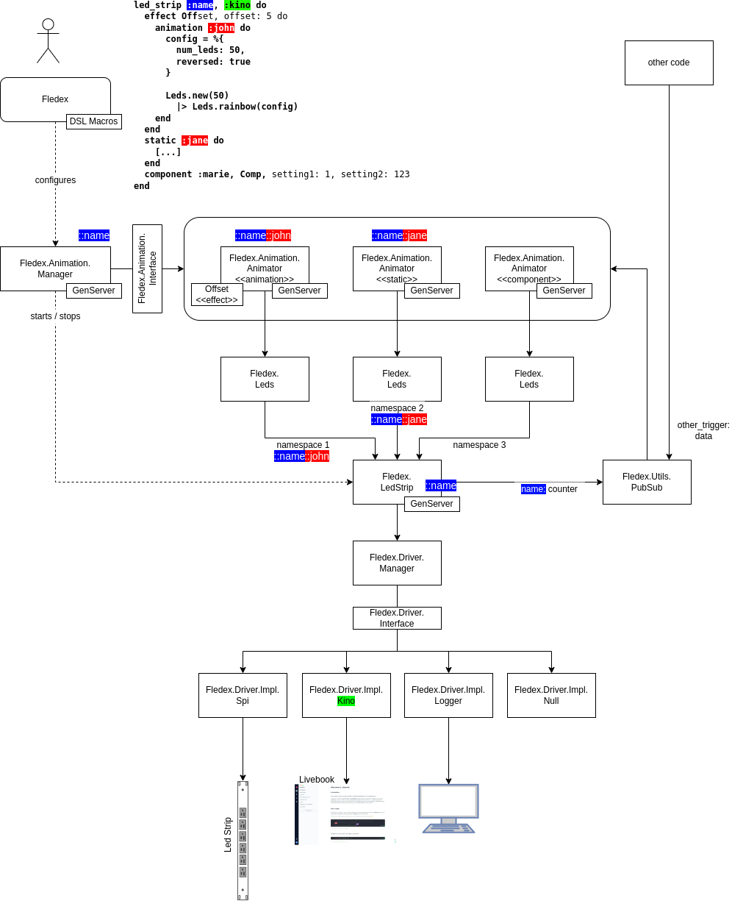

<!--
Copyright 2023, Matthias Reik <fledex@reik.org>

SPDX-License-Identifier: Apache-2.0
-->

# Overview
This document gives a rough overview over the architecture of Fledex. We first will 
look at the low level aspects (the different drivers) and then work our way up the 
stack.

# The drivers
The main interface to talk to the "hardware" is the `Fledex.LedStrip`. It takes the
`Fledex.Leds` definitions merges them and then passes the result to the actual 
hardware drivers. It plays about the same role as a window server in operating system.

The `Fledex.LedStrip` allows to define serveral namespaces that can have their own 
led definitions and that are only merged together at "display" time. This is similar 
in defining several windows in a window server. They all end up on the same display.

The `Fledex.LedStrip` does not really know how to talk to the actual hardware, but 
leaves this to the hardware spectific `Fledex.Driver.Driver`s. It's possible to 
register several drivers at the same time.

Currently there are 4 drivers available:
* `Spi` is the main driver for talking to a real 
  [led strip with a ws2801 chip](https://www.amazon.com/s?k=ws2801) over the spi bus
* `Kino` is a driver that is very convenient when working with a 
  [Livebook](https://livebook.dev/) to emulate an led strip.
* `Logger` is a driver that dumps the data to a logger.
* `Null` is a driver that acts similar to `/dev/null`, i.e. doesn't do anyting with the
  data. This can be very convenient for running some tests.

# The Leds
The `Leds` is an easy way to define a set of Leds. This module provides the 
possibility to specify individual leds by integer/name/rgb-values, by a generator 
function (like `rainbow/2`, or `gradient/2`), or by combining various `Leds` 
definitions into a single definition.

The `Leds` are not bound to a specific led strip (and namespace), but can be send 
to one by calling the `send()` function with the appropriate parameters. For 
convenience it's possible to bind it already during creation time to a specific 
led strip and namespace.

# The Animations
To define individual `Leds` is nice, but it would be even nicer, if it would be 
possible to animate the `Leds`. This is where the `Animator` comes in. It allows 
to define `Leds` and vary them through some triggers (like a timer/counter). 

It's possible to define this simply through a sequence of `Leds` definitions 
followed by a `send()` and some `Process.sleep()`, but that approach would have 
several limitations.

The `Animator` is a `GenServer` that loops through the animation function and allows
to modify the animation between loops.

The various `Fledex.Animation.Animator`s can be managed through a 
`Fledex.Animation.Manager`. It allows to create, redefine, and destroy animations 
(i.e.`Fledex.Animation.Animator`s) through a single configuration.

# The Fledex DSL
The ultimate goal is to define a `Fledex` DSL that can configure the 
`Fledex.Animation.Manager` and update annimations on the fly.

In the above diagram an example is shown on how such a DSL might look like. 

# The Triggers

The `Fledex.LedStrip` is publishing via `Fledex.Util.PubSub` an event (a trigger) 
that gets picked up by the `Fledex.Animation.Animator`s to change their animation. 
The trigger can not only be created by the driver, but also by external events. The
difference is that only the triggers from the driver is used by the `Fledex.Animation.
Animator`s to redefine the animation. All other triggers are collected over time and
can be used when updating the animation. 

For example: we want to be able to check the current temperature in regular interval 
and trigger a re-animation to adjust the "display" depending on the temperature.

# Final Notes
## Naming
The led naming, the namespace naming, and the `Fledex.LedStrip` server naming should 
all be driven by the `Fledex`  DSL. Even though it would be possible to have different
names it helps to align them. The `led_strip` name becomes the `Fledex.LedStrip` server
name. The `animation` name becomes the namespace name and combined with the `led_strip`
name the `Fledex.Animation.Animator` server name.
